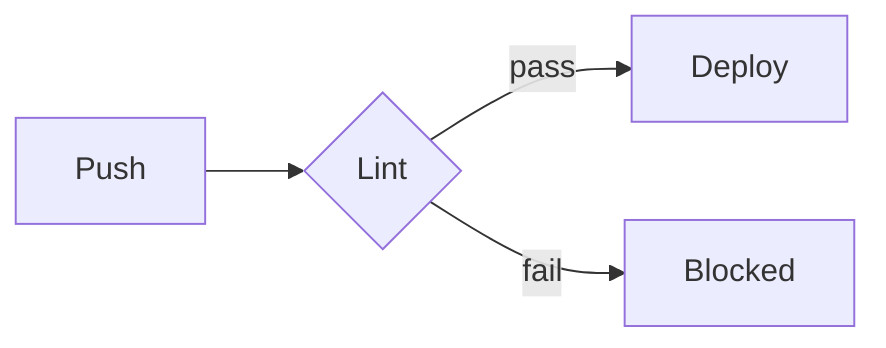

# Nice to Know

The grab-bag: GitHub platform features and `gh` CLI moves that save real time but nobody tells you about.

## GitHub URL Tricks

| Trick | How |
|-------|-----|
| Permalink to code | Press `y` on any file view — URL pins to the exact commit SHA |
| Link to line range | Click a line number, shift-click another → `#L10-L25` |
| Any PR as a patch | Append `.patch` or `.diff` to the PR URL |
| Compare anything | `/compare/v1.2.0...v1.3.0` or `/compare/main...feature-branch` |
| File finder | Press `t` in any repo — fuzzy filename search |
| Web editor | Press `.` in any repo — full VS Code in the browser |
| Blame skip formatting commits | Add a `.git-blame-ignore-revs` file; GitHub honors it automatically |

## Keyboard Shortcuts Worth Memorizing

- `t` — file finder · `y` — permalink · `.` — web editor
- `gc` — go to Code tab · `gi` — Issues · `gp` — Pull requests · `ga` — Actions
- `?` — full shortcut list on any page

## Issue & PR Superpowers

### Closing keywords

`Closes #123`, `Fixes #123`, `Resolves #123` in a PR description auto-closes the issue on merge. Multiple: `Closes #1, closes #2`.

### Cross-repo references

`thatobabusi/laravel-13-cheat-sheet#42` links an issue from any repo; the referenced issue gets a backlink automatically.

### Task lists that track

```markdown
- [ ] Step one
- [ ] Step two
```

In an issue body these render a progress bar in issue lists; convert any item to its own issue from the `⋯` menu.

### Saved replies

Settings → Saved replies — canned responses ("Thanks! Please add a failing test first…") inserted with one click in any comment box.

### Code suggestions in reviews

In a review comment, click the `±` icon (or write a ` ```suggestion ` block) — the author can apply your exact change with one click, committed as co-authored.

## Repo Configuration Gems

### CODEOWNERS

```
# .github/CODEOWNERS
*.yml           @thatobabusi
/docs/          @thatobabusi
/assets/        @thatobabusi
```

Auto-requests review from owners when their paths change; combine with branch protection's "require review from Code Owners".

### Repository templates

Settings → Template repository — new repos start from this one's full tree with clean history. Ideal for this standards repo's scaffold.

### Autolink references

Settings → Autolink references: map `TICKET-123` → your tracker URL; every mention becomes a link automatically.

### Default community files

A repo named `.github` at the account level provides fallback `CONTRIBUTING.md`, issue templates, `FUNDING.yml`, and profile README for every repo without their own.

## `gh` CLI Power Usage

### Daily drivers

```bash
gh pr create --fill                 # PR from branch, title/body from commits
gh pr checkout 123                  # check out someone's PR locally
gh pr diff 123                      # review without leaving the terminal
gh pr merge --squash --delete-branch
gh run watch --exit-status          # block until CI finishes (great in scripts)
gh run rerun --failed               # re-run only the failed jobs
```

### The API escape hatch

Anything the UI can do, `gh api` can script:

```bash
# Fix Pages build mode (the hybrid-config lesson):
gh api -X PUT repos/{owner}/{repo}/pages -f build_type=workflow

# All open PRs across your repos:
gh search prs --author=@me --state=open

# Latest release tag of any action (used for the Node 24 migration):
gh api repos/actions/checkout/releases/latest -q .tag_name
```

### JSON output + jq built in

```bash
gh pr list --json number,title,headRefName -q '.[] | "\(.number)\t\(.title)"'
gh run list --json conclusion -q 'map(select(.conclusion=="failure")) | length'
```

### Aliases

```bash
gh alias set co 'pr checkout'
gh alias set landed 'pr list --state merged --author @me --limit 10'
```

## Markdown Extras GitHub Renders

````markdown
> [!NOTE]
> Callout boxes: NOTE, TIP, IMPORTANT, WARNING, CAUTION



<details><summary>Collapsible section</summary>

Hidden until clicked — good for long logs in issues.

</details>
````

Also: paste a CSV into an issue comment and GitHub offers to render it as a table; drag-drop images/videos directly into any comment box.

## Small Things, Big Payoff

- **Draft PRs** are free CI runs without review noise — open early
- **`git commit --allow-empty -m "trigger ci"`** — rerun pipelines without a fake change
- **Branch protection applies to admins only if you tick "Include administrators"** — tick it, protect yourself from yourself
- **Watch releases only:** Watch → Custom → Releases — follow a dependency without inbox noise
- **`gh repo edit --visibility`** exists, but remember Pages/private-repo limits on the free plan (learned the hard way in this repo)
- **Pin repos and gists** to your profile — the six slots are your portfolio

## See Also

- [Git Tips & Tricks](GIT_TIPS_TRICKS.md)
- [Actions Advanced](ACTIONS_ADVANCED.md)
- [Pull Request Process](PULL_REQUEST_PROCESS.md)
